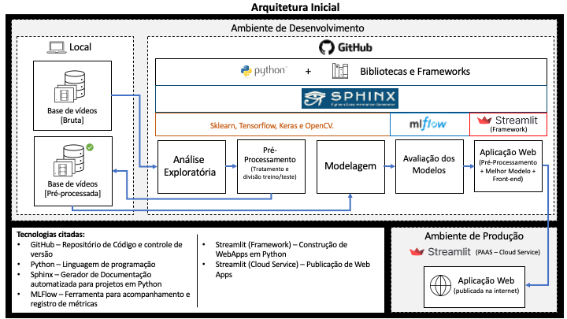

# Projeto Aplicado XPE: MBA em Machine Learning

## Objetivo:
O projeto tem por objetivo gerar uma solução de Machine Learning capaz de ajudar plataformas e usuários a classificar conteúdos em vídeos em relação a presença ou não de “deepfakes”. De forma a acelerar o processo de sinalização e remoção de conteúdo potencialmente falso.

Para se atingir o nosso objetivo final, o desenvolvimento seguirá as seguintes etapas: 
- Testar 3 diferentes modelos para detecção de deepfakes;
- Utilizar uma combinação de 3 diferentes datasets para treino e teste;
- Refinar modelos se aplicável (ajuste de hiperparametros, treino com mais dados, ajuste de camadas e etc…)
- Criar Ensemble para combinar modelos e obter melhores resultados.
- Gerar um benchmarking dos modelos;
- O melhor modelo será implantado na nossa solução.

*** 
## Metodologias

### - Design Thinking
O Design Thinking visa explorar estratégias criativas para identificaçãode problemas/desafios e proposição de soluções, sustentadas por hipóteses que são rapidamente testadas e validadas com os clientes reais. Combinado com a metodologia startup enxuta, do inglês lean startup, e as metodologias ágeis Permite sermos capazes de testar rapidamente os problemas, soluções,
segmentos de clientes, entre outros pontos essenciais para validar e operacionalizar qualquer ideia.

Essa metodologia será utilizada para a concepção do produto e sua aplicação estará registrada no relatório final do projeto aplicado.

### - CRISP-DM
O CRISP-DM (Cross Industry Standard Process for Data Mining ou processo padrão da indústria cruzada para mineração de dados) é um método ágil focado na resolução de problemas. 

Atualmente é uma das metodologias mais utilizadas no desenvolvimento de projetos em ciência de dados. Sendo de grande utilidade em cenários de incerteza na hora de resolver problemas de negócio. Em outras palavras, uma etapa só é iniciada quando a anterior foi submetida a um processo de validação, o que implica em mudanças ao longo do tempo. 

Portanto, o CRISP DM é uma metodologia flexível, capaz de lidar com problemas complexos envolvendo uma grande quantidade de dados.

Etapas do CRISP-DM no projeto aplicado:

- **Entender o Negócio**: Foca na compreensão do objetivo do projeto a partir de uma perspectiva de negócios, definindo um plano preliminar e uma estrutura de desenvolvimento.
- **Entender os Dados**: Coleta de dados e inicio de atividades para familiarização com os dados, identificando problemas ou conjuntos interessantes.
- **Preparação dos Dados**: Construção do conjunto de dados final a partir dos dados iniciais. 
- **Modelagem**: Aplicação de técnicas de otimização, seleção de variavéis e modelagem.
- **Avaliação**: Verificação das principais métricas visando entender se o modelo atinge os objetivos do negócio.
- **Implantação**: Os resultados obtidos a partir do modelo são disponibilizads de uma forma que os clientes possam consumir.

***
## Padronização:
Para padronizar a estrutura de arquivos do projeto, foi utilizado o <a href="https://www.cookiecutter.io/" target="_blank">Cookiecutter</a>. Trata-se de um repositório Open Source com templates de diferentes tipos. Cada template possui pastas e arquivos normalmente utilizados em seu respectivo tipo de projeto/tecnologia. 

Nosso projeto utiliza o Cookiecutter de Data Science da <a href="https://www.drivendata.org" target="_blank">Driven Data</a>.

Referências:
- <a href="https://drivendata.github.io/cookiecutter-data-science" target="_blank">Documentação Cookiecutter Data Science</a>

Organização do projeto:

<mark>[Detalhar alterações durante o desenvolvimento]</mark>

    ├── LICENSE
    ├── Makefile           <- Makefile with commands like `make data` or `make train`
    ├── README.md          <- The top-level README for developers using this project.
    ├── data
    │   ├── external       <- Data from third party sources.
    │   ├── interim        <- Intermediate data that has been transformed.
    │   ├── processed      <- The final, canonical data sets for modeling.
    │   └── raw            <- The original, immutable data dump.
    │
    ├── docs               <- A default Sphinx project; see sphinx-doc.org for details
    │
    ├── models             <- Trained and serialized models, model predictions, or model summaries
    │
    ├── notebooks          <- Jupyter notebooks. Naming convention is a number (for ordering),
    │                         the creator's initials, and a short `-` delimited description, e.g.
    │                         `1.0-jqp-initial-data-exploration`.
    │
    ├── references         <- Data dictionaries, manuals, and all other explanatory materials.
    │
    ├── reports            <- Generated analysis as HTML, PDF, LaTeX, etc.
    │   └── figures        <- Generated graphics and figures to be used in reporting
    │
    ├── requirements.txt   <- The requirements file for reproducing the analysis environment, e.g.
    │                         generated with `pip freeze > requirements.txt`
    │
    ├── setup.py           <- makes project pip installable (pip install -e .) so src can be imported
    ├── src                <- Source code for use in this project.
    │   ├── __init__.py    <- Makes src a Python module
    │   │
    │   ├── data           <- Scripts to download or generate data
    │   │   └── make_dataset.py
    │   │
    │   ├── features       <- Scripts to turn raw data into features for modeling
    │   │   └── build_features.py
    │   │
    │   ├── models         <- Scripts to train models and then use trained models to make
    │   │   │                 predictions
    │   │   ├── predict_model.py
    │   │   └── train_model.py
    │   │
    │   └── visualization  <- Scripts to create exploratory and results oriented visualizations
    │       └── visualize.py
    │
    └── tox.ini            <- tox file with settings for running tox; see tox.readthedocs.io

***
## Arquitetura:
